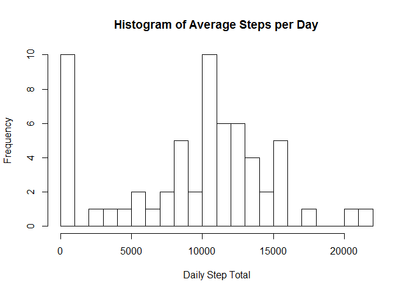

# Reproducible Research: Peer Assessment 1


## Loading and preprocessing the data
csv file has been unzipped into assignment root directory

Read into data table:

```r
fit_table<-read.csv("activity.csv")
head(fit_table)
```

```
##   steps       date interval
## 1    NA 2012-10-01        0
## 2    NA 2012-10-01        5
## 3    NA 2012-10-01       10
## 4    NA 2012-10-01       15
## 5    NA 2012-10-01       20
## 6    NA 2012-10-01       25
```


## What is mean total number of steps taken per day?

This is not what the assignment is asking for.  It wants a single number -- the average of total daily steps.  Plus a histogram.  Read the instructions carefully!


```r
total_steps <- by(fit_table$steps,fit_table$date,sum,na.rm=TRUE)
hist(total_steps,breaks=20)
```

 

```r
summary(total_steps)
```

```
##    Min. 1st Qu.  Median    Mean 3rd Qu.    Max. 
##       0    6778   10400    9354   12810   21190
```

```r
mean(total_steps)
```

```
## [1] 9354.23
```

```r
median(total_steps)
```

```
## 2012-10-20 
##      10395
```

## What is the average daily activity pattern?


## Imputing missing values


## Are there differences in activity patterns between weekdays and weekends?
